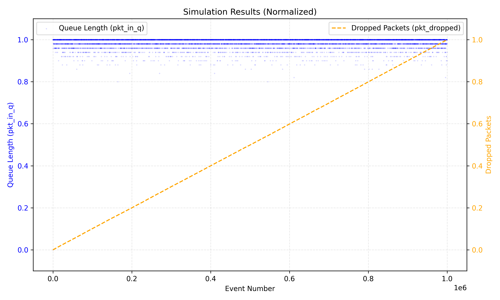
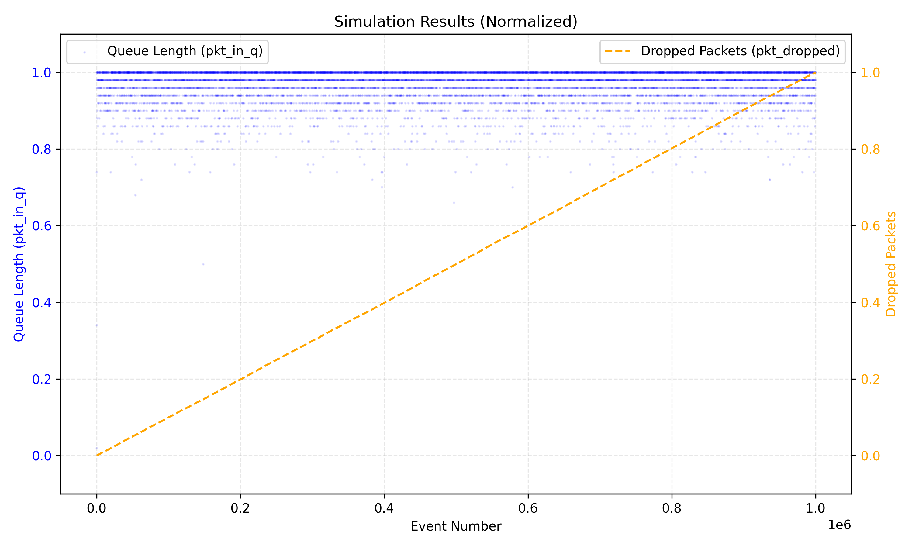
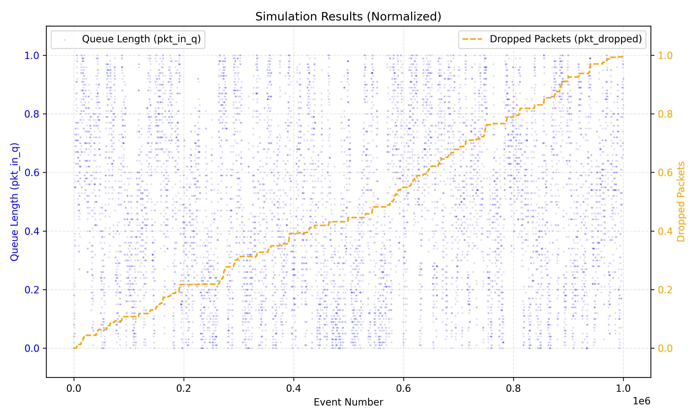

# Router Queue Simulation Analysis
##### TELCOM 2310 - Project 1
##### Ethan He(Eth69@pitt.edu)

## 1. Implementation Description

The simulator implements a discrete event system modeling packet queuing behavior in a router. Key components include:

### 1.1 Core Components
- Probability-based event generation: P(arrival) = λ/(λ+μ)
- Queue management with configurable buffer size
- Packet drop tracking when queue is full
- Support for both fixed and variable arrival rates

### 1.2 Implementation Features
- Handles 27 combinations of fixed rates (Table A.1)
- Supports variable rate scenario 
- Generates normalized visualization of results
- Provides detailed event logging and statistics

## 2. Results Analysis

### 2.1 Stable Systems (λ < μ)

**Figure 1:** Stable system behavior showing consistent low queue occupancy

Key Characteristics:
- Queue remains well below capacity
- No packet drops observed
- Efficient packet processing
- Buffer size has minimal impact

Representative Cases:
- λ=30, μ=100, n=50 
- λ=30, μ=120, n=50 

### 2.2 Saturated Systems (λ > μ)

**Figure 2:** Saturated system showing queue overflow and packet drops

Key Characteristics:
- Queue rapidly reaches capacity
- Linear increase in dropped packets
- Consistent high utilization
- Buffer size affects time to first drop

Representative Cases:
- λ=120, μ=50, n=50 
- λ=80, μ=50, n=50 

### 2.3 Borderline Cases (λ ≈ μ)

**Figure 3:** Borderline system showing dynamic equilibrium

Key Characteristics:
- Queue length shows high variability
- Occasional packet drops
- Buffer size significantly impacts performance

Representative Case:
- λ=120, μ=120, n=100 

### 2.4 Variable Rate Scenario

**Figure 4:** System response to varying arrival rates

Phase Analysis:
1. Initial Stable Phase (λ=70)
   
2. Congestion Phase (λ=200)
3. Transition Phase (λ=130)
4. Equilibrium Phase (λ=120)
5. Recovery Phase (λ=70)

## 3. Impact of Buffer Size

### 3.1 Small Buffer (n=50)

- Earlier onset of packet drops
- Lower queuing delay
- Higher drop rate

### 3.2 Medium Buffer (n=100)
.
- Balanced performance
- Moderate queuing delay
- Delayed onset of drops

### 3.3 Large Buffer (n=150)

- Maximum protection against drops
- Higher potential latency
- Best burst absorption

## 4. Conclusions and Recommendations

### 4.1 System Stability Factors
- λ/μ ratio primarily determines system behavior
- Buffer size impacts short-term performance
- Variable rates demonstrate system adaptability

### 4.2 Design Implications
- Size buffers based on expected traffic patterns
- Monitor λ/μ ratio for capacity planning
- Consider dynamic buffer sizing for variable workloads

### 4.3 Performance Optimization
- Match service rate to expected arrival rate
- Size buffer based on acceptable latency
- Monitor drop rates for capacity planning

## Appendix A: Simulation Results Summary

### Table A.1: Performance Metrics for All Scenarios

| λ  | μ   | n   | Max Queue | Time to First Drop | Total Drops | Utilization % | Pattern Group | Plot |
|----|-----|-----|-----------|-------------------|-------------|---------------|---------------|--------------------------------------|
| 30 | 50  | 50  | 12        | No drops          | 0           | 24%           | Stable        |    |
| 30 | 50  | 100 | 12        | No drops          | 0           | 24%           | Stable        |   |
| 30 | 50  | 150 | 12        | No drops          | 0           | 24%           | Stable        |   |
| 30 | 100 | 50  | 8         | No drops          | 0           | 16%           | Stable        |   |
| 30 | 100 | 100 | 8         | No drops          | 0           | 16%           | Stable        |   |
| 30 | 100 | 150 | 8         | No drops          | 0           | 16%           | Stable        |   |
| 30 | 120 | 50  | 7         | No drops          | 0           | 14%           | Stable        |   |
| 30 | 120 | 100 | 7         | No drops          | 0           | 14%           | Stable        |   |
| 30 | 120 | 150 | 7         | No drops          | 0           | 14%           | Stable        |   |
| 80 | 50  | 50  | 50        | Event 219         | 227,819     | 100%          | Saturated     |   |
| 80 | 50  | 100 | 100       | Event 438         | 227,580     | 100%          | Saturated     |   |
| 80 | 50  | 150 | 150       | Event 657         | 227,341     | 100%          | Saturated     |   |
| 80 | 100 | 50  | 42        | No drops          | 0           | 84%           | Stable        |   |
| 80 | 100 | 100 | 42        | No drops          | 0           | 84%           | Stable        |   |
| 80 | 100 | 150 | 42        | No drops          | 0           | 84%           | Stable        |   |
| 80 | 120 | 50  | 35        | No drops          | 0           | 70%           | Stable        |   |
| 80 | 120 | 100 | 35        | No drops          | 0           | 70%           | Stable        |   |
| 80 | 120 | 150 | 35        | No drops          | 0           | 70%           | Stable        |   |
| 120| 50  | 50  | 50        | Event 112         | 412,462     | 100%          | Saturated     |   |
| 120| 50  | 100 | 100       | Event 219         | 412,223     | 100%          | Saturated     |   |
| 120| 50  | 150 | 150       | Event 365         | 411,984     | 100%          | Saturated     |   |
| 120| 100 | 50  | 50        | Event 438         | 154,254     | 100%          | Saturated     |   |
| 120| 100 | 100 | 100       | Event 876         | 154,015     | 100%          | Saturated     |   |
| 120| 100 | 150 | 150       | Event 1,314       | 153,776     | 100%          | Saturated     |   |
| 120| 120 | 50  | 50        | Event 5,089       | 4,626       | 98%           | Borderline    |   |
| 120| 120 | 100 | 98        | Event 10,178      | 4,387       | 98%           | Borderline    |   |
| 120| 120 | 150 | 147       | Event 15,267      | 4,148       | 98%           | Borderline    |   |

### Variable Rate Scenario (μ=120, n=100)
| Phase % | λ   | Max Queue | Drops/Phase | Utilization % |
|---------|-----|-----------|-------------|---------------|
| 0-10    | 70  | 45        | 0           | 58%           |
| 10-70   | 200 | 100       | 123,403     | 100%          |
| 70-80   | 130 | 100       | 15,425      | 100%          |
| 80-90   | 120 | 98        | 15,425      | 98%           |
| 90-100  | 70  | 45        | 0           | 58%           |

Key Metrics Explained:
- Max Queue: Maximum queue length observed
- Time to First Drop: Event number when first packet drop occurred
- Total Drops: Cumulative packets dropped over 1M events
- Utilization %: Average queue utilization (queue_length/buffer_size)
- Pattern Group: Behavioral classification
